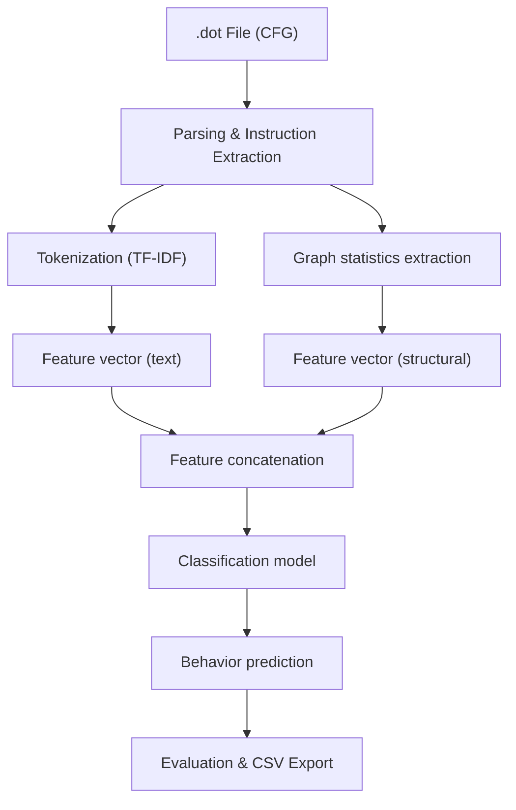

# 🛡️ Binary-Malicious-Behavior-Detection

> Cybersecurity and Artificial Intelligence Challenge organized by [Université Paris I Panthéon-Sorbonne](https://www.pantheonsorbonne.fr) and the ComCyber unit of the French Ministry of the Interior, as part of the [Sorbonne Data Challenge](https://sorbonne-data-challenge.fr/).

This project offers an automated analysis solution to detect **malicious behaviors** in Windows binaries (PE and DLL files), based on their **Control Flow Graph (CFG)**. Using NLP techniques, graph analysis, and supervised classification, our model predicts suspicious behaviors observed during sandbox execution.

---

## 📌 Objectives

- Leverage **control flow graphs (CFGs)** to analyze the execution logic of programs.
- Develop a model capable of **automatically predicting** potentially malicious behaviors.
- Provide analysts with a fast and reliable tool to **accelerate threat detection**.

---

## 🧠 Modeling Approach

The processing pipeline follows five main steps:

### 1. Parsing & Preprocessing
- Read `.dot` files representing the CFG of each binary.
- Extract assembly instructions and block relations using `NetworkX`.
- Clean up graphs and standardize instructions.

### 2. Tokenization & Vectorization
- **Tokenize** instructions (`mov`, `jmp`, `call`, etc.) to extract opcodes and operands.
- Apply **TF-IDF** on instruction sequences to capture frequent malicious patterns.
- Create textual representations usable by classifiers.

### 3. Feature Engineering
- Global graph statistics: number of nodes, edges, presence of cycles, max depth, etc.
- Hybrid representation combining **structural features** and **textual features**.

### 4. Supervised Modeling
- Train multiclass/multi-label models:
  - `Random Forest`, `Logistic Regression`, etc.
- Use **One-vs-Rest** strategy to handle the multi-label nature of behaviors.
- Data splitting with cross-validation and grid search.

### 5. Evaluation & Export
- Evaluate using **Macro F1-score** (robust to class imbalance).
- Visualize results:
  - Confusion matrices, distributions, CFG graphs.
- Generate prediction `.csv` file in One-Hot format for final submission.

---

## ⚙️ Technologies Used

- **Language:** Python 3.6+
- **Environment:** Jupyter Notebook
- **Libraries:**
  - `pandas`, `numpy` – data handling
  - `scikit-learn` – classification and evaluation models
  - `networkx`, `graphviz` – graph processing and visualization
  - `matplotlib`, `seaborn` – result visualization
  - `re`, `os`, `glob` – `.dot` file parsing

---

## 🕵️ Business Context

This project addresses a **real-world cybersecurity problem**: automating the detection of suspicious behaviors in binaries executed in a controlled environment.  
It uses data provided by **CNENUM**, ComCyber's expertise center, as part of a **high-level Data Challenge**.

Target behaviors include:
- Abnormal memory read/write,
- Unauthorized network connections,
- Windows Registry modification,
- Shell execution or code injection.

---

## 📈 Results Achieved

- Built a robust end-to-end pipeline: parsing, feature engineering, training, and prediction.
- Good overall performance in Macro F1-score (official challenge metric).
- Model generalizable to other detection contexts (obfuscated software, other OSs…).

---

## 🔄 Global Pipeline



---

## 📂 Project Directory Structure

```plaintext
AI-based-Malicious-Behavior-Detection/
│
├── 📄 README.md                             # Main documentation
├── 📄 requirements.txt                      # Python dependencies to install
├── 📄 LICENSE                               # Project license (MIT)
├── 📄 Briefing_Data_Challenge.pdf           # Official challenge statement
│
├── 📁 notebooks/
│   └── 📄 main.ipynb                        # Main notebook with complete pipeline
│
├── 📁 data/
│   ├── 📁 digraphs/                         # CFG .dot files
│   ├── 📄 training_set_metadata.csv         # Behavioral training tags
│   ├── 📄 your_data_updated.csv             # Updated behavioral training tags
│   ├── 📄 predictions.csv                   # Prediction results (test)
│   └── 📁 npz_matrices/
│       ├── tf_batch_0.npz                  # Complete TF batch matrix
│       ├── tfidf_matrix.npz                # Complete TF-IDF matrix
│       └── reduced_tfidf_matrix.npz        # Reduced version after selection of features / PCA
│
└── 📁 visuals/                              # Visualizations (graphs, CFG, confusion matrix, etc.)
    ├── graph_example.png
    └── confusion_matrix.png
```

---

## ▶️ Run the Project

```bash
# Clone the repository
git clone https://github.com/bilal-jaiel/AI-based-Malicious-Behavior-Detection.git

# Navigate to the project folder
cd AI-based-Malicious-Behavior-Detection

# Install dependencies
pip install -r requirements.txt

# Launch the main notebook
jupyter notebook notebooks/main.ipynb
```

---

## 🔧 Future Improvements

- Implement a **GNN (Graph Neural Network)** model to directly process CFGs as graphs.
- Advanced representations (Word2Vec on instructions, graph embeddings).
- Integrate a **web dashboard** to visualize threats.
- CI/CD pipeline for full automation.

---

## 👨‍💻 Authors

| Name              | 🔗 Links |
|-------------------|----------|
| **Bilâl Jaiel**     | [](https://www.linkedin.com/in/bilal-jaiel/) [](https://github.com/bilal-jaiel) |
| **Alexis Schneider** | [](https://www.linkedin.com/in/alexis-schneider-a91079325/) [](https://github.com/Alexis-Schneider) |
| **Akram Halimi**     | [](https://www.linkedin.com/in/akram-halimi-010217321/) [](https://github.com/A-Jassim) |

---

## 📄 License

Distributed under the MIT license. See the [LICENSE](LICENSE) file for more information.
