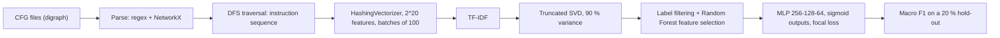

<div align="center">

# Malicious Behaviour Detection in Windows Binaries

Predicting what a Windows program does (memory tricks, network activity, file writes, packers)<br>
from the control-flow graph of its machine code, without running it.


</div>

<br>

| | |
|---|---|
| Context | Team entry to the [Sorbonne Data Challenge](https://sorbonne-data-challenge.fr/) (Université Paris 1 Panthéon-Sorbonne and the ComCyber unit of the French Ministry of the Interior, 2025) |
| Task | Multi-label classification: 453 behaviours per binary, about 20,000 binaries |
| Approach | Instructions as text: hashed TF-IDF, truncated SVD, MLP trained with a focal loss |
| Metric | Macro F1-score, which weighs rare behaviours as much as frequent ones |

---

## Contents

- [Context](#context)
- [Approach](#approach)
- [Getting started](#getting-started)
- [Repository structure](#repository-structure)
- [Results](#results)
- [Known limitations](#known-limitations)

---

## Context

Malware analysts at CNENUM, ComCyber's expertise centre, need to know quickly what a suspicious binary does. Running every sample in a sandbox is slow, so the challenge asks whether the behaviours observed in the sandbox can be predicted statically, from the program's code alone.

| | |
|---|---|
| Input | For each Windows binary (PE or DLL), the control-flow graph of its x86 / x86-64 code: nodes are instruction blocks, edges are jumps, calls and returns |
| Output | 453 binary labels per binary, for example *allocate RWX memory*, *act as TCP client*, *write file on Windows*, or a packer family |

Data format and expected layout: [`data/README.md`](data/README.md).

## Approach


```mermaid
graph LR
    A["CFG files (digraph)"] --> B["Parse: regex + NetworkX"]
    B --> C["DFS traversal: instruction sequence"]
    C --> D["HashingVectorizer, 2^20 features, batches of 100"]
    D --> E["TF-IDF"]
    E --> F["Truncated SVD, 90 % variance"]
    F --> G["Label filtering + Random Forest feature selection"]
    G --> H["MLP 256-128-64, sigmoid outputs, focal loss"]
    H --> I["Macro F1 on a 20 % hold-out"]
```

| Step | Details |
|---|---|
| Graph parsing | Each file is read line by line; regular expressions extract nodes (address, instruction type, assembly) and edges into a `networkx.DiGraph` |
| Linearisation | A depth-first traversal orders the instruction labels, turning each graph into a "document" that keeps the control-flow order |
| Vectorisation at scale | A `HashingVectorizer` (2²⁰ features, no vocabulary to store) runs batch by batch in a thread pool, then a `TfidfTransformer` reweights the stacked matrix; sparse matrices are cached on disk |
| Dimension reduction | `TruncatedSVD` keeps the number of components explaining 90 % of the variance |
| Label filtering | Behaviours present in fewer than 5 % or more than 95 % of the binaries are set aside |
| Feature selection | A Random Forest ranks the SVD components; those above the mean importance are kept |
| Model | Keras MLP (256, 128, 64 units, batch normalisation, 40 % dropout, sigmoid outputs), Adam with learning rate 5·10⁻⁴, early stopping, a focal-style loss (γ = 2, α = 0.25) meant to handle the label imbalance |
| Evaluation | Macro F1 on a 20 % hold-out set |

The last cells load the saved model and run inference on a test feature matrix; as written, they still read the training graph folder (see the limitations).

## Getting started

```bash
git clone https://github.com/bilal-jaiel/Binary-Malicious-Behavior-Detection.git
cd Binary-Malicious-Behavior-Detection
pip install -r requirements.txt
python -m spacy download en_core_web_sm   # loaded by the extraction cell
```

Place the challenge files in `data/` as described in [`data/README.md`](data/README.md), then run `notebooks/main.ipynb` from the `notebooks/` folder. Feature extraction on the full corpus is the long step; intermediate matrices are cached in `data/npz_matrices/`.

## Repository structure

```
├── notebooks/
│   └── main.ipynb      parsing, vectorisation, SVD, MLP, test inference
├── data/
│   └── README.md       data format (data not redistributed)
├── requirements.txt
└── LICENSE
```

## Results

No final score is recorded in this repository: the notebook was committed without its training outputs, and the challenge data needed to re-run it is not included.

## Known limitations

- Feature and label alignment. Graphs are vectorised in the order in which files are read and processed in parallel, while labels follow the order of the CSV; the two are aligned by position, with truncation. Rows must be paired by file name (SHA-256) before any score can be trusted.
- Incomplete focal loss. The implemented loss keeps only the positive term `-α (1 - p)^γ y log p`; negatives contribute no loss, so nothing penalises predicting a behaviour that is absent. The `(1 - y)` term must be added before training again.
- Test pipeline not wired. The inference cells re-extract features from `../data/digraphs` (the training folder) and then load `test/tfidf_matrix.npz`, which no cell writes. The test graphs and output paths must be set before the inference can run.
- Test-time transformations. The test cells hash instructions into 2¹⁹ features (2²⁰ for training) and fit a new TF-IDF and SVD on the test graphs instead of reusing the training ones, so test features do not live in the training space. The fitted transformers should be saved and reused.
- Graph structure is only partly used. A DFS order keeps some control flow, but loops and branching are lost; graph statistics or a graph neural network would exploit them directly.
- Instruction normalisation. Addresses and immediate values are kept in the tokens; normalising them (for example `mov reg, imm`) would shrink the vocabulary and help generalisation.

---

<div align="center">
<sub>Bilâl Jaiel · <a href="https://github.com/Alexis-Schneider">Alexis Schneider</a> · <a href="https://github.com/A-Jassim">Akram Halimi</a><br>
<a href="https://github.com/bilal-jaiel">GitHub</a> · <a href="https://www.linkedin.com/in/bilal-jaiel/">LinkedIn</a> · MIT license</sub>
</div>
